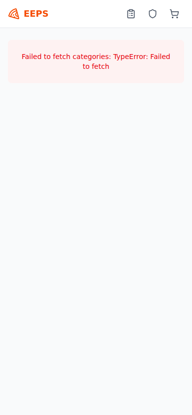
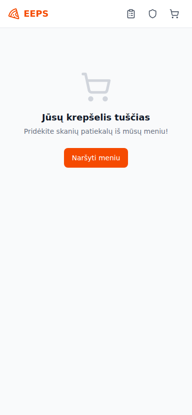
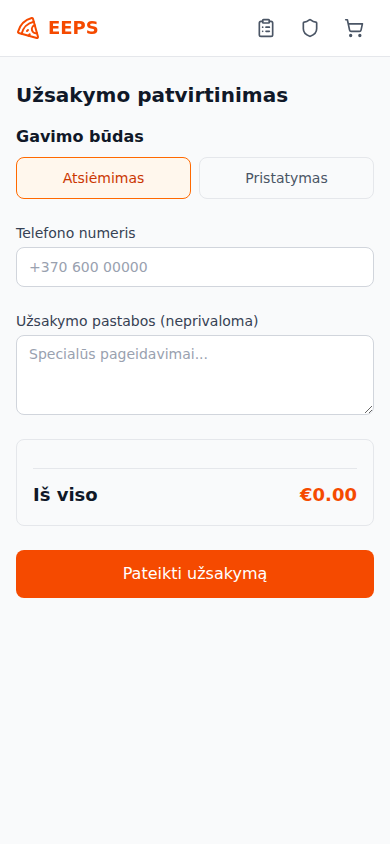
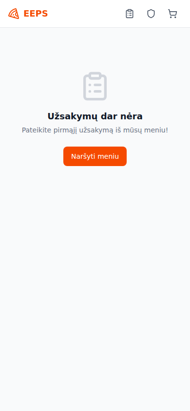
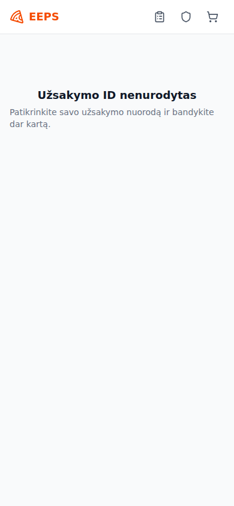
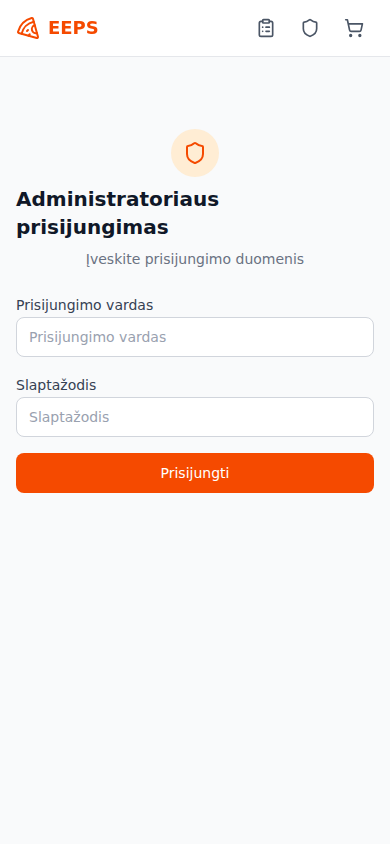

# EEPS

A mobile-first digital ordering system for a local pizza and kebab shop. Customers browse the menu, customize items, add to cart, checkout, and track orders in real-time. An admin dashboard lets staff manage incoming orders through their lifecycle.

Live site: [https://justassav.github.io/eeps/](https://justassav.github.io/eeps/)

## Tech Stack

- **Framework:** Next.js 15 (App Router) with React 19
- **Language:** TypeScript
- **Styling:** Tailwind CSS 4 (mobile-first)
- **State:** Zustand with localStorage persistence
- **Backend:** None (client-side localStorage)
- **Icons:** lucide-react
- **Deployment:** GitHub Pages via GitHub Actions

## Getting Started

### Prerequisites

- Node.js 18+

### Installation

```bash
git clone https://github.com/justasSav/eeps.git
cd eeps
npm install
```

No environment variables are required. The app runs entirely client-side with hardcoded menu data and localStorage persistence.

### Development

```bash
npm run dev
```

### Build

```bash
npm run build
```

### Lint

```bash
npm run lint
```

## Deployment

The project is configured to deploy automatically to GitHub Pages on every push to `main`.

### Setup

1. Go to your repository **Settings > Pages > Source** and select **GitHub Actions**
2. Push to `main` -- the workflow in `.github/workflows/deploy.yml` builds and deploys the static site

The Next.js app is configured with `output: "export"` for static generation, and the base path is set automatically by the GitHub Pages action.

## Features

- Menu browsing with search and category filtering
- Shopping cart with product deduplication
- Checkout with delivery and pickup options
- Order tracking by 3-digit code
- Admin dashboard with demo login authentication

## Screenshots

| Home / Menu | Cart | Checkout |
|:-----------:|:----:|:--------:|
|  |  |  |

| Orders | Tracking | Admin Login |
|:------:|:--------:|:-----------:|
|  |  |  |

## Admin Area

The admin dashboard is available at [/admin](https://justassav.github.io/eeps/admin). It is the staff-facing control panel for processing customer orders from arrival to completion.

**Authentication:** The admin area is protected by a login gate. Use the demo credentials to access it:

| Field | Value |
|-------|-------|
| **Username** | `demo` |
| **Password** | `demo` |

The session is persisted in localStorage, so you stay logged in across page reloads. Use the "Atsijungti" (Logout) button in the dashboard header to end the session.

**Purpose:** Give kitchen and counter staff a single screen to monitor, process, and fulfil all incoming orders.

**Main features:**

- **Login gate** — demo admin user authentication (username: `demo`, password: `demo`)
- **Order queue** — view all active orders (non-completed, non-cancelled), sorted oldest-first so the most urgent appear at the top
- **Order details** — each card shows the order ID, fulfillment type (delivery or collection), timestamp, contact phone, delivery address, line items with prices, optional customer notes, and the total amount
- **Status progression** — advance an order one step at a time through the lifecycle: `CREATED → ACCEPTED → PREPARING → READY → COMPLETED`
- **Order cancellation** — cancel any active order at any stage
- **Manual refresh** — refresh the order list on demand
- **Logout** — end the admin session and return to the login screen

## Data Storage

All data is stored client-side in localStorage using Zustand stores with persist middleware. There is no backend database.

- **Cart:** `pizza-kebab-cart` localStorage key
- **Orders:** `eeps-orders` localStorage key
- **Admin auth:** `eeps-admin-auth` localStorage key

SQL migrations in `supabase/migrations/` document the original schema design but are not used by the running application.

**Order status lifecycle:** `CREATED -> ACCEPTED -> PREPARING -> READY -> COMPLETED` (or `CANCELLED`)

## License

MIT
